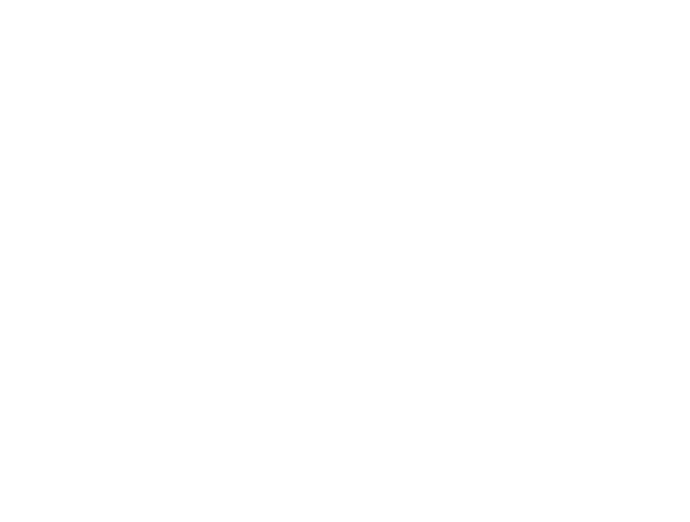

# ⚡ Electricity Market Price Forecasting

A Machine Learning project that predicts **Day-Ahead Market (DAM) electricity prices** using historical bidding and market data.

The project covers the complete Machine Learning workflow, including data preprocessing, exploratory data analysis, feature engineering, model building, evaluation, and deployment using Streamlit.

---

# Project Overview

Electricity prices in the Day-Ahead Market fluctuate based on demand, supply, bidding behaviour, and time-related factors.

The objective of this project is to build a Machine Learning model capable of predicting the **Market Clearing Price (MCP)** using historical market data.

---

# Business Problem

Electricity market participants submit bids one day before electricity delivery.

Accurate price prediction helps participants:

- Improve bidding strategies
- Reduce financial risk
- Understand market behaviour
- Support data-driven decision making

---

# Dataset

**Dataset File:** DAM.xlsx

**Time Period:** 2018–2024

The dataset contains historical Day-Ahead Market information including:

- Purchase Bid (MW)
- Sell Bid (MW)
- Market Clearing Volume (MCV)
- Final Scheduled Volume
- Date & Time information
- Market Clearing Price (Target)

---

## Model File

The trained Random Forest model (`electricity_price_model.pkl`) is not included in this repository because of GitHub's file size limitations.

To recreate the model:

1. Open the notebook in the `notebooks/` folder.
2. Run all cells to train the model.
3. Save the trained model using Joblib.

# Project Workflow

Data Collection

↓

Data Cleaning

↓

Exploratory Data Analysis (EDA)

↓

Feature Engineering

↓

Model Training

↓

Model Evaluation

↓

Model Comparison

↓

Streamlit Deployment

---

# Exploratory Data Analysis

The following analyses were performed:

- Missing value analysis
- Correlation heatmap
- Hourly electricity price trend
- Feature relationship analysis

---

# Feature Engineering

Several time-series and calendar-based features were created to improve prediction performance.

Examples include:

- Lag Features
  - Lag_1
  - Lag_4
  - Lag_96
  - Lag_672

- Rolling Mean Features
  - Rolling_Mean_4
  - Rolling_Mean_96

- Calendar Features
  - Year
  - Month
  - Day
  - Hour
  - Minute
  - DayOfWeek
  - Quarter
  - WeekOfYear
  - IsWeekend

Total Engineered Features: **19**

---

# Machine Learning Models

Three regression models were trained and compared:

- Linear Regression
- Random Forest Regressor
- XGBoost Regressor

After evaluation, **Random Forest Regressor** achieved the best overall performance and was selected for deployment.

---

# Model Performance

| Metric | Value |
|---------|-------|
| R² Score | **0.9813** |
| MAE | **188.65** |
| RMSE | **379.22** |


## Application Preview


## Model Comparison



---

# Streamlit Application

The deployed application allows users to:

- Enter market input values
- Generate real-time electricity price predictions
- View the predicted Market Clearing Price (MCP)

---

# Project Structure

```text
Electricity-Price-Forecasting/

├── app/
├── data/
├── models/
├── notebooks/
├── results/
├── screenshots/
├── README.md
├── requirements.txt
└── .gitignore
```

---

# Technologies Used

- Python
- Pandas
- NumPy
- Scikit-learn
- XGBoost
- Streamlit
- Joblib
- Matplotlib
- Seaborn

---

# Future Improvements

Possible enhancements include:

- Hyperparameter tuning
- Cross-validation
- Model monitoring
- Real-time market data integration
- Deployment on Streamlit Community Cloud

---

# Author

**Rehana Parveen Shaik**

Beginner Machine Learning Portfolio Project
